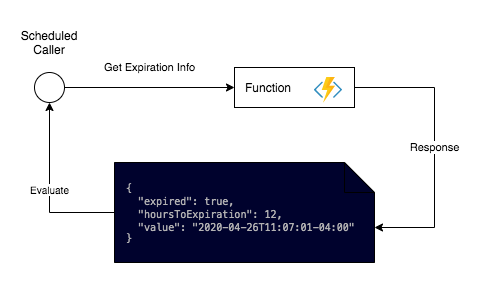
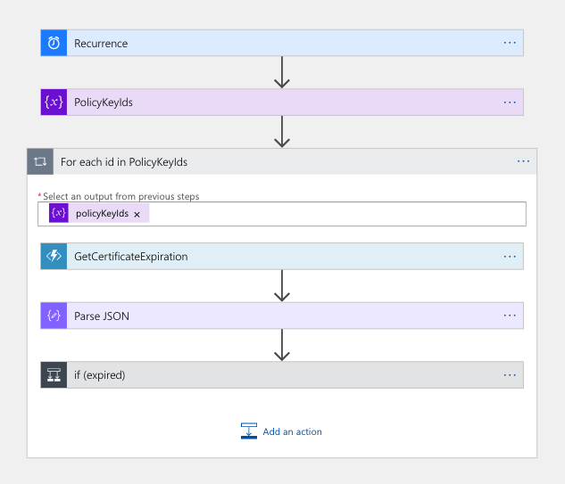
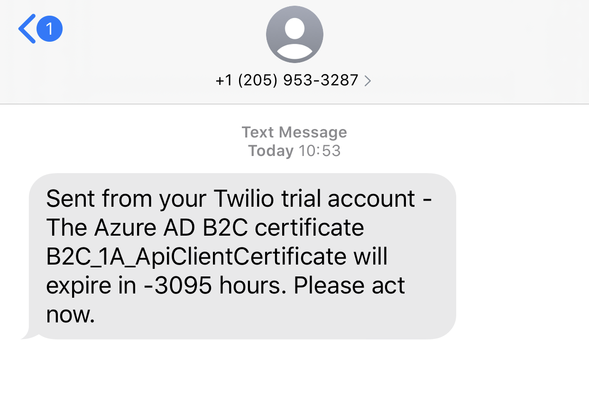

# Azure AD B2C - How To Check Certificate Expiration

Azure AD B2C allows for custom policies to have certificates uploaded to what's called a "KeySet". However, other than manually confirming the certificate's expiration date, there's really no easily apparent way to automate this.


Yet another C# example.

## Solution overview



Using Azure Functions, you'll retrieve an Azure AD B2C policy certificate's expiration date using the [Microsoft Graph SDK (beta)](https://docs.microsoft.com/en-us/graph/sdks/use-beta?context=graph%2Fapi%2F1.0&tabs=CS), fetching the [KeySet information](https://docs.microsoft.com/en-us/graph/api/trustframeworkkeyset-get?view=graph-rest-beta&tabs=http).

## Responding automatically

1.  You can use it as a webhook to get the result. Change it to a GET request
2. The FunctionApp can be changed to a scheduled trigger, log to Application Insights, then setup a log alert based on the JSON that it logs

# Prove it to me!

Follow these steps to get this setup and running.

```bash
# deploy 
func azure functionapp publish b2cutil-functionapp-8
```

1.  Create an [app registration in the B2C tenant](https://docs.microsoft.com/en-us/graph/auth-v2-service)
2. Give it **Application Permission** of [TrustFrameworkKeySet.Read.All](https://docs.microsoft.com/en-us/graph/api/trustframeworkkeyset-get?view=graph-rest-beta&tabs=http)
3. Set the values in the FunctionApp's application settings via the CLI or portal
4. Call the HTTP function with a POST request and get the result. 

## Running the serverless function locally

[Install the Azure Functions Core Tools](https://docs.microsoft.com/en-us/azure/azure-functions/functions-run-local?tabs=linux%2Ccsharp%2Cbash#install-the-azure-functions-core-tools)

```
cd src/Functions
func start --build
```

**App Settings:**

```
"B2C_CLIENT_ID":              "<client id, e.g. 845cea86-4a21-406a-b5ef-7abb75b8b5f9>"
"B2C_CLIENT_SECRET":    "<client secret>"
"B2C_TENANT_ID":            "<the b2c domain, e.g. mydomain.onmicrosoft.com>"
```


## Logic App - Scheduled check of a list of certificates 



Using a logic app found in ```src/Logic```, you can deploy this definition as an example of how to schedule the work to check a list of certificates.


**Example SMS message**


## Sample POST to the Azure Function

```
POST http://localhost:7071/api/GetCertificateExpiration

{
    "policyKeyId": "B2C_1A_Certificate"
}
```

Example response:

```
{
    "expired": true,
    "hoursToExpiration": -3077,
    "value": "2020-04-26T11:07:01-04:00"
}
```
